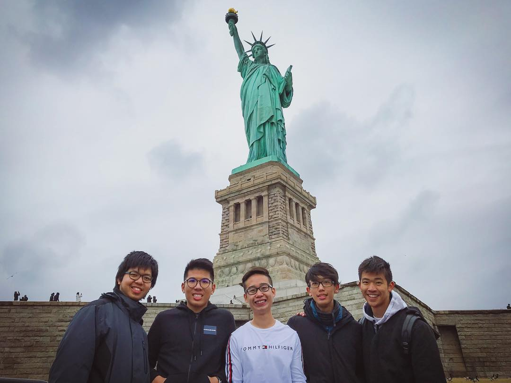

# Guan Ming Chee
---
I am from an island in Malaysia. A game that I palyed for more than 10 years is Mousehunt. I like to play martial arts but I am afraid of myself being hurt, which is pretty conflicting. I am a competitive person so I will be serious in both work and play, in which others will sometimes feel stressed around me.
[Link to my pic!](https://raw.githubusercontent.com/GuanMingChee/assignment2-Chee/main/about_me_image.jpg)



---
## Favorite Food/Drinks

| Food/Drinks | Location | Cost($) |
| ----------- | ----------- | ----------- |
| Pho | Mostly any asian restaurant (Simply Siam Thai Restaurant) | 5-10 |
| Hotpot | Hotpot restaurant (Lotus Hot Pot & Grill) | 20++ (depending on ingredients) |
| Samosas | Walmart | 15 per pack |

Both 3 delicacies above are Asian foods, where Pho is from Vietnam, Hotpot is from China and Samosas is from southern part of India. Pho is basically rice noodles with beef/chicken broth topped with fresh Thai basil and bean sprouts. This delicacy gives a strong taste of essence of bones from cow/chicken with a refreshing kick from the greens. Hotpot, in the other hand, is a delicacy which broth is being cooked in a big pot and ingredients are placed into the broth for a slight cooking in the simmering broth. It is a big feast that can be a good opportunity for gathering! Last but not least, amosas is an Indian snack that can fit one in your mouth per samosas. It consist of lentils and potatoes and meat.

---

## Best Quotes

> “Wubba Lubba Dub Dub!” — *Rick* <br>
> “Nobody exists on purpose. Nobody belongs anywhere. We’re all going to die. Come watch TV.” — *Morty*

---

## Code Algorithm (Geometry Convex hull)

> The Convex Hull is the line completely enclosing a set of points in a plane so that there are no concavities in the line. More formally, we can describe it as the smallest convex polygon which encloses a set of points such that each point in the set lies within the polygon or on its perimeter. [Click here to learn more](https://www.cs.auckland.ac.nz/software/AlgAnim/convex_hull.html)

[Source of code](https://cp-algorithms.com/geometry/grahams-scan-convex-hull.html)
```
struct pt {
    double x, y;
};

bool cmp(pt a, pt b) {
    return a.x < b.x || (a.x == b.x && a.y < b.y);
}

bool cw(pt a, pt b, pt c) {
    return a.x*(b.y-c.y)+b.x*(c.y-a.y)+c.x*(a.y-b.y) < 0;
}

bool ccw(pt a, pt b, pt c) {
    return a.x*(b.y-c.y)+b.x*(c.y-a.y)+c.x*(a.y-b.y) > 0;
}

void convex_hull(vector<pt>& a) {
    if (a.size() == 1)
        return;

    sort(a.begin(), a.end(), &cmp);
    pt p1 = a[0], p2 = a.back();
    vector<pt> up, down;
    up.push_back(p1);
    down.push_back(p1);
    for (int i = 1; i < (int)a.size(); i++) {
        if (i == a.size() - 1 || cw(p1, a[i], p2)) {
            while (up.size() >= 2 && !cw(up[up.size()-2], up[up.size()-1], a[i]))
                up.pop_back();
            up.push_back(a[i]);
        }
        if (i == a.size() - 1 || ccw(p1, a[i], p2)) {
            while(down.size() >= 2 && !ccw(down[down.size()-2], down[down.size()-1], a[i]))
                down.pop_back();
            down.push_back(a[i]);
        }
    }

    a.clear();
    for (int i = 0; i < (int)up.size(); i++)
        a.push_back(up[i]);
    for (int i = down.size() - 2; i > 0; i--)
        a.push_back(down[i]);
}
```
